# AspiroBrain Data Pipeline — Implementation Plan

> [!abstract] Source
> Synthesizes the 7 challenges from *"Research Note: Data Challenges in Building AspiroBrain"* with three parallel deep-research passes (pipeline/orchestration, data model/storage, LLM grounding/RAG), grounded in the scraping work already underway in `Data Collection/` — 100 Netherlands + 100 Malta master's programs from mastersportal.com.

## Current state (2026-07-10)

- 2 country CSVs, 17-column flat schema, single source (mastersportal.com — **tier 5 of 6** on the trust hierarchy the research note defines)
- Schema gaps: no `currency` column, no `last_verified_date`, no `program_id`, repeatable fields (prerequisites/tags/intakes) flattened into semicolon-separated text instead of real rows
- Bugs already caught and fixed manually: **tuition front-loading** (headline "€X/year" is sometimes an average across an uneven multi-year fee schedule — true year-1 payment must come from an explicit per-year breakdown table), and **scholarship-widget noise** (mastersportal shows a sitewide generic scholarship list on every page that isn't program-specific and must be filtered from `tags`)
- Process today is fully manual: 5 parallel AI agents scrape+validate 20 programs each, merge, commit

## Target architecture

```mermaid
graph LR
    A[Scrape: WebFetch + defuddle] --> B[Bronze: immutable raw snapshots]
    B --> C[Normalize: term_dictionary + RapidFuzz]
    C --> D[Validate: Pandera schema]
    D --> E[Diff: content hash vs last snapshot]
    E --> F[Entity resolution: exact to fuzzy to embedding]
    F --> G[(SQLite now, Postgres/Supabase later)]
    G --> H[Access API: filtered queries + live FX conversion]
    H --> I[AspiroBrain LLM: tool-calling, field-level grounding]
```



Every arrow above maps to one of the research note's 7 challenges — normalization solves heterogeneous formats, the diff step solves freshness, entity resolution solves program identity, the DB's `source_tier`/`verification_status` fields solve governance and missing-data honesty, and the access API + tool-calling solve currency and hallucination at the LLM boundary.

---

## Phase 0 — Fix now (before the next country scrape)

Cheapest, highest-leverage changes. No new infrastructure, just schema additions to the existing CSV pipeline — do this before Netherlands/Malta become 5+ countries and backfill gets expensive.

- [ ] Add `currency` column (ISO code) next to `tuition_1st_year` and `application_fee`. Backfill existing rows as `EUR`.
- [ ] Add `last_verified_date` column. Backfill from git commit date of each row (`git log`).
- [ ] Add `program_id` column — hash of normalized `(university_name, program_name, level)`. This is the join key everything downstream depends on; assign it now while it's cheap.
- [ ] Freeze current CSVs as immutable **Bronze snapshots**: copy each as `bronze/{country}_{scrape_date}.csv`, never edit in place again from this point forward.

> [!tip] Why now
> A one-time backfill script across 200 rows takes an hour. The same backfill across 2,000 rows across 10 countries is a much bigger, riskier job. Fix the schema while it's still cheap.

## Phase 1 — Pipeline automation (next 2–4 weeks)

**Scheduling/orchestration.** Skip Airflow/Dagster — both assume a data team this doesn't have. Start with **cron + a Python orchestrator script per country** running scrape → normalize → validate → diff sequentially, logging to a file. Migrate to **Prefect OSS** (free, Apache-2.0) once past ~5 countries or once retry/alerting logic is needed — it decorates existing functions with `@flow`/`@task` with minimal rewrite, unlike Dagster's asset-lineage model or Airflow's DAG overhead, neither of which fits "thousands of small program records" well.

**Change detection.** Compute a SHA-256 hash per `program_id` over normalized field values (excluding `last_verified_date`) after every scrape. Store `{program_id: hash}` as a small snapshot file. Next scrape: unchanged hash → just bump `last_verified_date`, zero re-verification; changed hash → flag into a `pending_review` queue with a field-level diff (`deepdiff` or column-by-column pandas compare). This turns re-verification from O(all rows) into O(changed rows) — the difference between manageable and impossible once you're past a few hundred programs.

**Normalization layer.** Three-tier, cheapest-first:
1. **Static YAML/CSV lookup tables** checked into the repo (e.g. `intake_terms.yaml`: `"Autumn Semester": "Fall"`) — deterministic, free, auditable.
2. **RapidFuzz** (`token_sort_ratio`/`WRatio`) against the canonical vocabulary for anything not in the lookup table.
3. **LLM normalization** only for what neither tier resolves, routed to a human/agent review queue — and every LLM-resolved mapping gets written back into the static table, so it's a one-time cost per new phrase, not recurring.

**Validation.** **Pandera**, not Great Expectations or raw Pydantic — DataFrame-native, lightweight, works directly on the existing pandas/CSV workflow. Schema-check dtypes, nullability, `program_id` uniqueness, tuition ≥ 0, `source_url` format. Great Expectations is the right tool later, if this ever needs multi-engine pipelines or non-technical stakeholders reading Data Docs — not now.

**Currency/FX.** Query-time conversion only, never stored. Two genuinely free, no-key options: **[Frankfurter API](https://frankfurter.dev)** (ECB-sourced daily rates, no rate limit) as primary, **[fawazahmed0/currency-api](https://github.com/fawazahmed0/exchange-api)** (200+ currencies incl. BDT, CDN-hosted, no key) as fallback for anything Frankfurter doesn't cover. Cache conversions with a ~1-hour TTL to avoid hammering the API on every user query.

## Phase 2 — Structured storage migration (once past ~3 countries)

**Schema** (replaces the flat 17-column CSV with real relational structure):

```
university(id, canonical_name, country, city, website_url, source_tier, created_at)

program(id, university_id, canonical_name, level, field_slug, duration_months,
        success_rate_pct, source_url, source_tier, last_verified_date,
        verification_status[verified|unverified|stale], confidence_level[high|medium|low],
        superseded_by, created_at, updated_at)

program_alias(id, program_id, raw_name_seen, source, first_seen_at)
  -- every scraped title variant, kept for entity-matching + audit trail

fee_line(id, program_id, fee_type[tuition_yr1|tuition_total|application_fee|deposit],
         amount, currency, source_url, last_verified_date, verification_status)
  -- original currency ONLY, never pre-converted

intake(id, program_id, term_label_raw, term_normalized[fall|spring|summer|winter],
       year, deadline_date, deadline_type, source_url, last_verified_date)

requirement(id, program_id, kind[prerequisite|must_have], text, is_confirmed_absent)
  -- real row per item, not a semicolon blob;
  -- is_confirmed_absent distinguishes "checked, none exist" from "not yet checked"

tag(id, label, category[scholarship|campus|accreditation|other])
program_tag(program_id, tag_id)

source(id, url, source_tier[1-6], name, notes)
term_dictionary(raw_term, normalized_term)  -- grows via ingest, feeds the normalization layer
```

**Program identity resolution** — three-stage, cheapest first:
1. **Exact match** on `(university_id, normalize(program_name))` → auto-update, log new phrasing in `program_alias`.
2. **RapidFuzz** on university+program name → **≥0.95 auto-merge**, **0.85–0.95 flag for human review**, **<0.85 new program**.
3. **Embedding similarity** as a tiebreaker signal only within the 0.85–0.95 flagged band — not an auto-merge trigger. Skip this tier entirely until volume justifies it; at 200–500 rows it's not worth the cost.

**Database technology: SQLite now, Postgres/Supabase later.** At current scale (single-writer, low hundreds of rows), SQLite with WAL mode + Litestream (S3 backup replication) is correct, not a compromise. **Upgrade trigger** — migrate to Supabase Postgres when *any* of these hits: concurrent writers >1 (e.g. AspiroBrain's backend also writing query logs), row count approaches ~50k programs, or the LLM backend needs to query live over a network rather than an embedded file. Supabase over raw Postgres/Neon because it bundles auth/storage/edge functions AspiroBrain will need anyway.

**Freshness/governance fields** live on every fact-bearing table (`program`, `fee_line`, `intake`, `requirement`): `source_url`, `last_verified_date`, `verification_status` (`stale` computed at query time from a policy window, e.g. >90 days — not a cron-maintained flag), `confidence_level`, and `source_tier` stored **per record**, not just per university, since a future tier-1 official-site fee line should outrank an existing tier-5 aggregator line for the same program.

**Access API** (thin layer between DB and LLM, not raw SQL from the RAG orchestrator):
- `GET /programs?country=&field=&level=&max_tuition_eur=&intake_term=` — converts fee lines to display currency via live FX at request time, filters `verification_status != stale` by default.
- `GET /programs/{id}` — full record incl. every `source_url` and `last_verified_date`, so the LLM can cite them.
- `GET /programs/{id}/history` — alias + fee_line audit trail for "has this changed" questions.
- Every response includes `source_tier` + `confidence_level` per field so the LLM can hedge language instead of stating facts flatly.

**Migration sequence:**
1. Freeze existing CSVs as Bronze snapshots (done in Phase 0).
2. Backfill `currency`/`last_verified_date`/`program_id` (done in Phase 0).
3. Validate all CSVs against the Pandera schema.
4. Build normalize→validate→diff as pure DataFrame-in/DataFrame-out functions (storage-agnostic).
5. Load into staging tables via `INSERT ... ON CONFLICT (program_id) DO UPDATE`, run per Bronze CSV in scrape order to preserve history.
6. Only after staging is verified, point new scrapes directly at the DB — CSVs become the audit trail, not the source of truth.

## Phase 3 — LLM grounding layer (build in parallel with / after Phase 2)

**Retrieval — hybrid, filter-first, not vector-everywhere.** Structured queries (country/budget/degree/deadline) hit the DB directly via SQL, no embeddings involved. Fuzzy-intent queries ("I want to work in robotics") embed the query, run vector similarity for candidate `program_id`s, then **re-apply hard filters (budget/country/tier) via SQL on that candidate set** — vectors generate candidates, they never enforce hard constraints.

**Embeddings & vector store.** Embed only curated text — `canonical_name + tags + a short curated description` — never raw scraped HTML. **`text-embedding-3-small`** as the default embedding model (cheap, strong enough at this scale); upgrade to Cohere `embed-v4` only if Bangla/mixed-language queries become common. **pgvector** on the same Postgres instance as the relational store — at "low thousands of programs" this avoids standing up and operating a second vector-DB service (Qdrant/Weaviate) for a team of one.

**Hallucination prevention — tool-calling with field-level grounding (primary defense).** The LLM never free-generates a fact. It calls `get_program_details(program_id)`, which returns typed JSON where every field carries `value`, `verification_status`, and `last_verified_date`. System prompt requires: state only values present in the tool output; if a field is `null` or unverified, emit the required fallback verbatim — *"could not be verified from official university sources, please consult an Aspiro counselor..."* A cheap post-generation regex/entity check (flag any date/number absent from the tool payload) is a secondary net, not the primary defense — it only catches, it doesn't prevent.

**Currency conversion — deterministic tool call, never LLM arithmetic.** `convert_currency(amount, from_currency, to_currency="BDT")` calls a live FX API server-side; the model only interpolates the returned number into text, it never computes the conversion itself. Same Frankfurter/fawazahmed0 stack as Phase 1, or Fastforex if a native MCP server is preferred for the tool-use loop.

**Communicating trust tier & freshness.** Concrete pattern: append a source line to tuition/deadline claims — *"(Source: mastersportal.com — third-party aggregator, tier 5/6, last verified 45 days ago)."* Since 100% of current data is tier 5, auto-append the counselor-referral fallback whenever `source_tier` is below tier 2 **or** `last_verified_date` exceeds the freshness threshold, even when a value exists. On cross-source conflicts, show both values labeled by tier, recommend the higher-tier one, and flag the conflict for manual review.

---

## Tech stack summary

| Layer | Now | Upgrade trigger | Later |
|---|---|---|---|
| Orchestration | cron + Python scripts | >5 countries or need retries/alerting | Prefect OSS |
| Normalization | static YAML lookup + RapidFuzz | unresolved phrase volume grows | + LLM fallback, written back to lookup table |
| Validation | Pandera | multi-engine pipelines / non-technical stakeholders | Great Expectations |
| Storage | SQLite + Litestream | concurrent writers, >~50k rows, network access needed | Supabase (Postgres) |
| Entity resolution | exact → RapidFuzz | 0.85–0.95 review queue too large to handle manually | + embedding tiebreaker |
| Vector search | none | fuzzy "I want to study X" queries go live | pgvector on same Postgres instance |
| Embeddings | — | — | `text-embedding-3-small`, upgrade to Cohere embed-v4 if multilingual |
| FX rates | Frankfurter API (primary), fawazahmed0/currency-api (fallback) | intraday-rate need | paid tier (ExchangeRate-API, Open Exchange Rates) |
| LLM grounding | — | — | tool-calling with field-level grounding, not free-text citation |

## Open questions to raise with the AspiroWork team

> [!question] Before committing engineering time
> - Is mastersportal.com meant to stay the sole data source, or is there a plan to reach tier-1/tier-2 sources (official university sites/APIs) — since the entire trust-hierarchy design in the research note only pays off once there's more than one tier actually represented in the data?
> - Who owns the `pending_review` queue for fuzzy-match entity resolution (0.85–0.95 band) and flagged data changes — is that the intern's job, a counselor's, or does it need a lightweight review UI?
> - What's the actual timeline/budget for standing up Postgres/Supabase and an LLM backend — Phase 0–1 can run entirely inside the current CSV/git workflow, but Phase 2–3 need real infrastructure decisions from the team, not just the intern's scraping pipeline.

## Immediate next action

Phase 0 is doable today inside the current `Data Collection/` workflow with no new tools: add `currency`, `last_verified_date`, `program_id` columns and freeze the existing two CSVs as Bronze snapshots. Say the word and this gets built into the Netherlands/Malta files now.

---

### Further reading (sources surfaced during research)

- [Frankfurter API](https://frankfurter.dev)
- [fawazahmed0/exchange-api (GitHub)](https://github.com/fawazahmed0/exchange-api)
- [Decoding Data Orchestration Tools: Prefect, Dagster, Airflow, Mage](https://engineering.freeagent.com/2025/05/29/decoding-data-orchestration-tools-comparing-prefect-dagster-airflow-and-mage/)
- [Prefect vs Dagster](https://www.prefect.io/compare/dagster)
- [RapidFuzz — A Fast, Flexible, Modern Library](https://medium.com/@amarshaw83/rapidfuzz-339295aece71)
- [The data validation landscape in 2025](https://aeturrell.com/blog/posts/the-data-validation-landscape-in-2025/)
- [Great Expectations vs Pandera](https://medium.com/@bhagyarana80/8-great-expectations-vs-pandera-which-fits-your-python-stack-a115c9241dcb)
- [SQLite vs Postgres for the Solo Founder in 2026](https://abhishekchaudhary.com/blog/sqlite-vs-postgres-solo-founder)
- [SQLite vs Supabase for Solo Developers](https://solodevstack.com/blog/sqlite-vs-supabase-solo-developers)
- [Fuzzy Matching 101: The Complete Guide to Accurate Data Matching](https://dataladder.com/fuzzy-matching-101/)

## Related

- [[Data Collection]]
